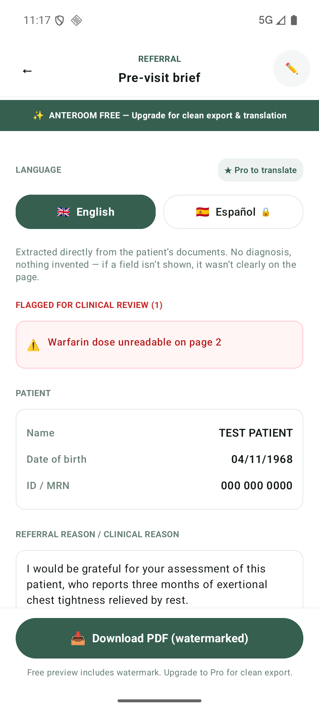
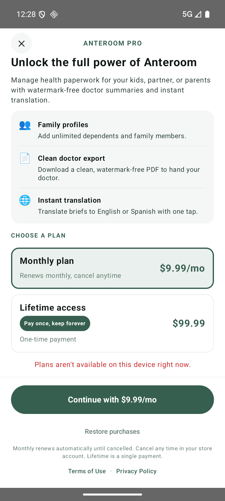
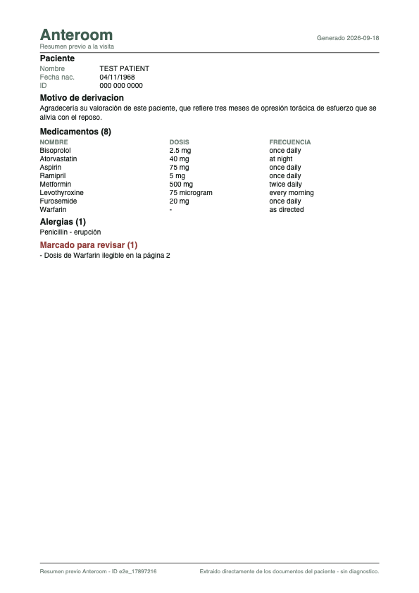
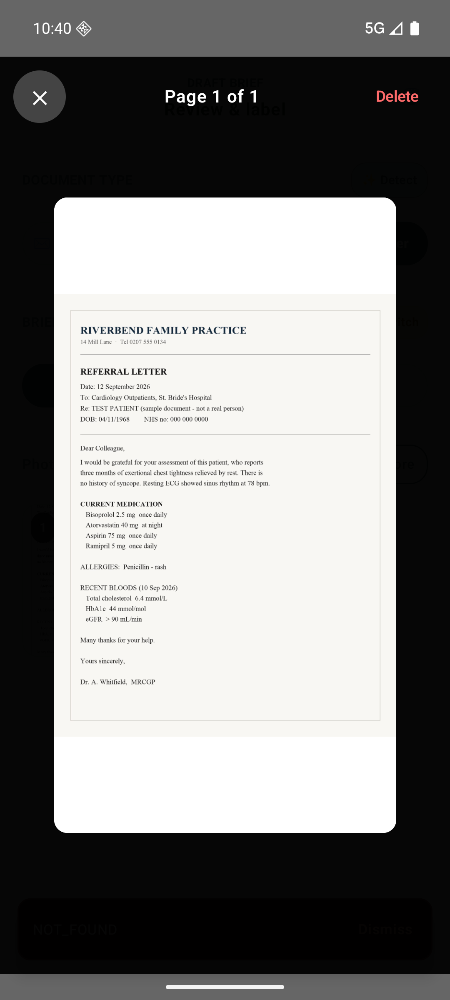

# Anteroom

**Photograph your medical paperwork. Walk into the appointment ready.**

Anteroom turns photos of referrals, prescriptions, medication lists and
discharge summaries into one structured brief a patient can hand to a doctor —
in English or Spanish, as a PDF, from a phone, a laptop or a browser.

One Kotlin Multiplatform codebase. Android, iOS, Desktop and Web, with a 100%
Compose Multiplatform UI and no per-platform screens. Billing is RevenueCat
`purchases-kmp`: one implementation, two stores.

> Built for the RevenueCat Ship-a-ton. Build 1.0 (2) is on TestFlight,
> in Apple's Beta App Review.

<p align="center">
  
  
  
</p>

---

## The problem

A patient arrives at a specialist carrying a plastic folder. Inside is a
referral from one hospital, a discharge summary from another, and a medication
list a pharmacist wrote by hand. The doctor has twelve minutes. Most of them go
on reading paper.

The clinical cost is not the reading time. It is that the patient cannot
reliably answer "what are you taking, and at what dose" — and the paperwork
that could answer it is unsorted, in the wrong language, or at home.

## Why an extraction that guesses is worse than none

This is the design constraint the whole app is built around.

A model asked to read a smudged prescription will produce a plausible dose.
Plausible is the failure mode that kills people: a clinician reading
`Warfarin 5 mg` on a tidy screen has no way to know the paper said something
else, or said nothing legible at all.

So Anteroom refuses. When a value cannot be read with confidence the field
stays **empty** and the item is listed under **flagged for review**, with the
source photograph one tap away.

<p align="center">
  
</p>

That behaviour is enforced in three places rather than asserted in a prompt:

- **Extraction** uses a Vertex AI `response_schema`, so a missing dose is a
  null field and not a sentence to parse.
- **Translation** never regenerates clinical text. `merge_translation` copies
  drug names, numeric doses and units across untouched; only prose is
  translated, and medication frequency is localized through a deterministic
  lookup table, not the model.
- **A test proves it.** `tools/verify_pipeline.py` uploads a prescription whose
  Warfarin dose has been deliberately smudged illegible, and asserts the dose is
  *absent* from `medications` and *present* in `flagged_items`. A model that
  guessed would pass a test that only checked the readable rows.

## Architecture

```
Compose Multiplatform UI ── one App.kt, four targets
          │
          ├── Firestore / Cloud Storage      direct, authorized by security rules
          │
          └── Cloud Functions (Python 3.12, europe-west1)
                    classifyDocType    Gemini 2.5 Flash
                    generateBrief      Gemini 2.5 Pro, structured output
                    translateBrief     Pro-gated server side
                    renderBriefPdf     watermark derived from entitlement
                    revenuecatWebhook  the only writer of the entitlement doc
```

| Layer | Technology |
| --- | --- |
| UI | Compose Multiplatform 1.12, Material 3, shared across all targets |
| Shared logic | Kotlin Multiplatform 2.4.20 |
| Targets | Android, iOS (arm64 and simulator), Desktop (JVM), Web (JS) |
| Auth and data | Firebase Auth, Firestore, Storage through GitLive |
| Backend | Firebase Cloud Functions, Python 3.12, `europe-west1` |
| Extraction | Gemini 2.5 Pro and 2.5 Flash on Vertex AI, `europe-west1` |
| Billing | RevenueCat `purchases-kmp` 3.8.0 |

Two properties are structural rather than promised:

**The client cannot write clinical fields.** `content`, `status`,
`generated_at` and the share token are rejected from every client by
`firestore.rules`. Cloud Functions own them. "Nothing invented" is a property of
the system, not a claim about the UI.

**The paywall cannot be bypassed from the client.** `renderBriefPdf` takes no
`watermarked` argument — the server derives it from
`users/{uid}/billing/entitlement`, which only the RevenueCat webhook writes.
A client that could ask for a clean export *would be* the paywall.

## RevenueCat

`expect fun createRevenueCatService()` picks the implementation per target. The
store-backed one lives in `src/mobileMain/kotlin`, compiled into both
`androidMain` and `iosMain` — one implementation, Google Play and StoreKit, no
platform branches in the calling code. Desktop and Web get a simulated service
that keeps the paywall navigable and reports `isSimulated = true`, so the UI
says out loud that no charge occurred.

The paywall reacts to entitlement state rather than to button taps, so it
behaves correctly when a subscription changes on another device.

| Product | Price |
| --- | --- |
| Anteroom Pro Monthly | $9.99 / month |
| Anteroom Pro Lifetime | $99.99 once |

Pro unlocks family profiles, clean watermark-free export, and translation.

## Build and run

```bash
./gradlew :app:androidApp:assembleDebug            # Android
./gradlew :app:desktopApp:run                      # Desktop (JVM)
./gradlew :app:webApp:jsBrowserDevelopmentRun      # Web (JS)
open app/iosApp/iosApp.xcodeproj                   # iOS, then run in Xcode
```

Requirements: an Android SDK matching `android-compileSdk` in
`gradle/libs.versions.toml`, and Xcode with its license accepted for iOS.

The backend deploys with `firebase deploy --only functions`.

## Verification

Nothing here is self-reported; each suite runs against the live project.

```bash
python3 tools/verify_rules.py              # 21 checks — security rules
python3 tools/verify_pipeline.py           # 43 checks — end-to-end extraction
python3 tools/verify_account_deletion.py   # 17 checks — account erasure
functions/venv/bin/python functions/tests/test_pipeline.py   # 56 offline checks
```

`verify_rules.py` proves cross-user reads are denied, that a client cannot write
`content` or `status`, and that an unconstrained brief query is refused.
`verify_account_deletion.py` builds a throwaway account holding a user document,
a profile, a brief, a Storage image and a usage counter, deletes it, then checks
each from the outside — including re-registering the email, which is what
distinguishes a deleted record from a disabled one.

## Documentation

| Document | What it covers |
| --- | --- |
| [docs/DEVPOST_SUBMISSION.md](docs/DEVPOST_SUBMISSION.md) | The submission write-up |
| [docs/PIPELINE_OPERATIONS.md](docs/PIPELINE_OPERATIONS.md) | Region trade-offs, spend levers, no service-account key |
| [docs/APP_REVIEW_NOTES.md](docs/APP_REVIEW_NOTES.md) | App Review answers, demo account, compliance |
| [docs/BACKEND_FIREBASE_MIGRATION.md](docs/BACKEND_FIREBASE_MIGRATION.md) | Why the FastAPI backend became Firebase |
| [docs/demo-video/](docs/demo-video/) | Storyboard, script, captions, render pipeline |

## A note on scope

Anteroom is an organisational tool. It does not diagnose, does not recommend
treatment, and is not a medical device. Every brief carries a reminder to check
it against the original documents, because extraction from a photograph is
imperfect by nature — which is the reason the app marks what it could not read
instead of filling it in.

[Privacy Policy](https://anteroom-d2e72.web.app/privacy) ·
[Terms of Use](https://anteroom-d2e72.web.app/terms) ·
[Support](https://anteroom-d2e72.web.app/support)
